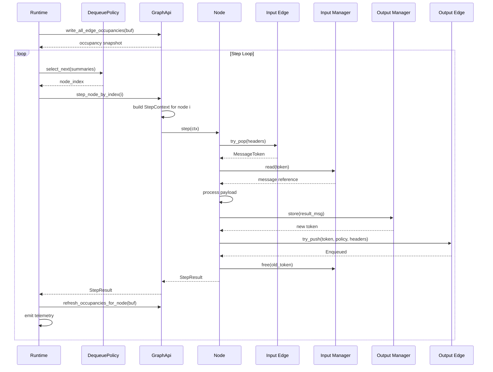

# no_std Single-Threaded Graph Flow

This document describes how a Limen graph executes on a bare-metal target with
no heap and no threads — the default `no_std` execution path.

---

## Execution Flow



---

## Key Properties

### Single `&mut self` Borrow

The entire graph is accessed through a single `&mut self` reference. There are
no `Arc`, no `Mutex`, and no shared references. `StepContext` borrows the
relevant edges and managers for the duration of one step, then releases them.

### StaticMemoryManager

`StaticMemoryManager<P, DEPTH>` uses a fixed-size `[Option<Message<P>>; DEPTH]`
array and a simple freelist. No heap. `ReadGuard` is a direct `&Message<P>`
reference — zero overhead.

### StaticRing

`StaticRing<N>` is a stack-allocated ring buffer of `MessageToken` handles.
Fixed capacity, no allocation, no locking.

### Zero Allocation After Init

Once `runtime.init()` completes, no further allocation occurs. All memory
is pre-allocated in the graph struct (nodes, edges, managers). The step loop
runs indefinitely without touching the allocator.

### Round-Robin Scheduling

The P0 `TestNoStdRuntime` uses a simple round-robin `DequeuePolicy`. It cycles
through all nodes, stepping each one that reports `Ready`. The P1
`NoAllocRuntime` (in progress) will use policy-enforcing schedulers like
`EdfPolicy` and `ThroughputPolicy`.

---

## Memory Layout

```
Stack / Static
├── Graph struct
│   ├── Node 0 (Source)           ← owns sensor state
│   ├── Node 1 (Model)           ← owns inference state + scratch buffer
│   ├── Node 2 (Sink)            ← owns output handle
│   ├── Edge 0: StaticRing<8>    ← [MessageToken; 8] ring buffer
│   ├── Edge 1: StaticRing<4>    ← [MessageToken; 4] ring buffer
│   ├── Manager 0: StaticMM<P, 8> ← [Option<Message<P>>; 8] slots
│   └── Manager 1: StaticMM<Q, 4> ← [Option<Message<Q>>; 4] slots
├── Runtime
│   ├── Occupancy buffer: [EdgeOccupancy; 2]
│   └── Scheduler state
├── Clock (NoStdLinuxMonotonicClock or NoopClock)
└── Telemetry (NoopTelemetry or GraphTelemetry)
```

Everything lives on the stack or in static memory. No heap, no indirection.

---

## Related

- [Runtime Model](runtime.md) — the `LimenRuntime` trait
- [Memory Model](memory_manager.md) — `StaticMemoryManager` details
- [Edge Model](edge.md) — `StaticRing` details
- [Concurrent Graph Flow](graph_flow_concurrent.md) — the `std` alternative
